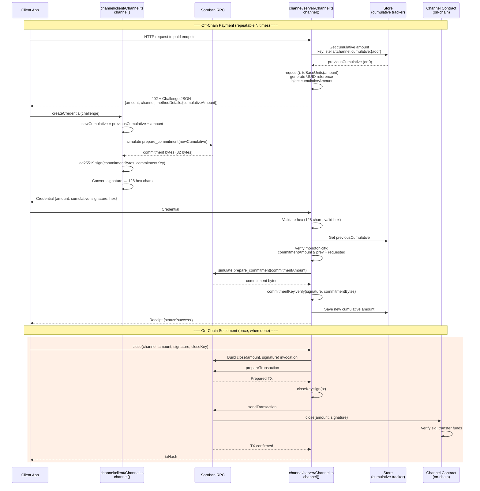

# Channel Payment Flow — Off-Chain Commitments + On-Chain Close

```mermaid
sequenceDiagram
    participant App as Client App
    participant CC as channel/client/Channel.ts<br/>channel()
    participant RPC as Soroban RPC
    participant SC as channel/server/Channel.ts<br/>channel()
    participant Store as Store<br/>(cumulative tracker)
    participant Contract as Channel Contract<br/>(on-chain)

    Note over App,Contract: === Off-Chain Payment (repeatable N times) ===

    App->>SC: HTTP request to paid endpoint
    SC->>Store: Get cumulative amount<br/>key: stellar:channel:cumulative:{addr}
    Store-->>SC: previousCumulative (or 0)
    SC->>SC: request(): toBaseUnits(amount)<br/>generate UUID reference<br/>inject cumulativeAmount
    SC-->>App: 402 + Challenge JSON<br/>{amount, channel, methodDetails:{cumulativeAmount}}

    App->>CC: createCredential(challenge)
    CC->>CC: newCumulative = previousCumulative + amount
    CC->>RPC: simulate prepare_commitment(newCumulative)
    RPC-->>CC: commitment bytes (32 bytes)
    CC->>CC: ed25519.sign(commitmentBytes, commitmentKey)
    CC->>CC: Convert signature → 128 hex chars
    CC-->>App: Credential {amount: cumulative, signature: hex}

    App->>SC: Credential
    SC->>SC: Validate hex (128 chars, valid hex)
    SC->>Store: Get previousCumulative
    SC->>SC: Verify monotonicity:<br/>commitmentAmount ≥ prev + requested
    SC->>RPC: simulate prepare_commitment(commitmentAmount)
    RPC-->>SC: commitment bytes
    SC->>SC: commitmentKey.verify(signature, commitmentBytes)
    SC->>Store: Save new cumulative amount
    SC-->>App: Receipt {status:'success'}

    Note over App,Contract: === On-Chain Settlement (once, when done) ===

    rect rgb(255, 240, 230)
        App->>SC: close(channel, amount, signature, closeKey)
        SC->>RPC: Build close(amount, signature) invocation
        SC->>RPC: prepareTransaction
        RPC-->>SC: Prepared TX
        SC->>SC: closeKey.sign(tx)
        SC->>RPC: sendTransaction
        RPC->>Contract: close(amount, signature)
        Contract->>Contract: Verify sig, transfer funds
        RPC-->>SC: TX confirmed
        SC-->>App: txHash
    end
```
