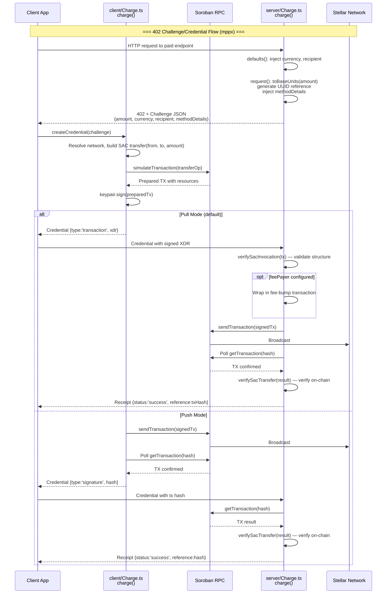

# Charge Payment Flow — On-Chain SAC Transfer

```mermaid
sequenceDiagram
    participant App as Client App
    participant CC as client/Charge.ts<br/>charge()
    participant RPC as Soroban RPC
    participant SC as server/Charge.ts<br/>charge()
    participant Chain as Stellar Network

    Note over App,Chain: === 402 Challenge/Credential Flow (mppx) ===

    App->>SC: HTTP request to paid endpoint
    SC->>SC: defaults(): inject currency, recipient
    SC->>SC: request(): toBaseUnits(amount)<br/>generate UUID reference<br/>inject methodDetails
    SC-->>App: 402 + Challenge JSON<br/>{amount, currency, recipient, methodDetails}

    App->>CC: createCredential(challenge)
    CC->>CC: Resolve network, build SAC transfer(from, to, amount)
    CC->>RPC: simulateTransaction(transferOp)
    RPC-->>CC: Prepared TX with resources

    CC->>CC: keypair.sign(preparedTx)

    alt Pull Mode (default)
        CC-->>App: Credential {type:'transaction', xdr}
        App->>SC: Credential with signed XDR
        SC->>SC: verifySacInvocation(tx) — validate structure
        opt feePayer configured
            SC->>SC: Wrap in fee-bump transaction
        end
        SC->>RPC: sendTransaction(signedTx)
        RPC->>Chain: Broadcast
        SC->>RPC: Poll getTransaction(hash)
        RPC-->>SC: TX confirmed
        SC->>SC: verifySacTransfer(result) — verify on-chain
        SC-->>App: Receipt {status:'success', reference:txHash}
    else Push Mode
        CC->>RPC: sendTransaction(signedTx)
        RPC->>Chain: Broadcast
        CC->>RPC: Poll getTransaction(hash)
        RPC-->>CC: TX confirmed
        CC-->>App: Credential {type:'signature', hash}
        App->>SC: Credential with tx hash
        SC->>RPC: getTransaction(hash)
        RPC-->>SC: TX result
        SC->>SC: verifySacTransfer(result) — verify on-chain
        SC-->>App: Receipt {status:'success', reference:hash}
    end
```
