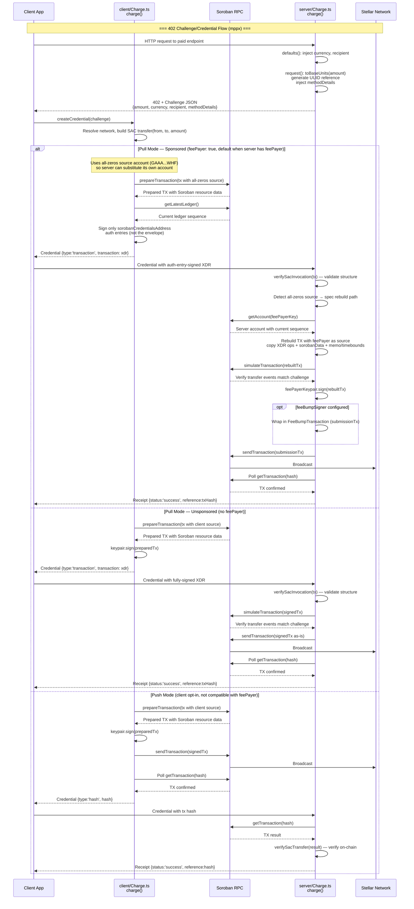

# Charge Payment Flow — On-Chain SAC Transfer

> Implements [draft-stellar-charge-00](https://paymentauth.org/draft-stellar-charge-00)

```mermaid
sequenceDiagram
    participant App as Client App
    participant CC as client/Charge.ts<br/>charge()
    participant RPC as Soroban RPC
    participant SC as server/Charge.ts<br/>charge()
    participant Chain as Stellar Network

    Note over App,Chain: === 402 Challenge/Credential Flow (mppx) ===

    App->>SC: HTTP request to paid endpoint
    SC->>SC: defaults(): inject currency, recipient
    SC->>SC: request(): toBaseUnits(amount)<br/>generate UUID reference<br/>inject methodDetails
    SC-->>App: 402 + Challenge JSON<br/>{amount, currency, recipient, methodDetails}

    App->>CC: createCredential(challenge)
    CC->>CC: Resolve network, build SAC transfer(from, to, amount)

    alt Pull Mode — Sponsored (feePayer: true, default when server has feePayer)
        Note over CC: Uses all-zeros source account (GAAA...WHF)<br/>so server can substitute its own account
        CC->>RPC: prepareTransaction(tx with all-zeros source)
        RPC-->>CC: Prepared TX with Soroban resource data
        CC->>RPC: getLatestLedger()
        RPC-->>CC: Current ledger sequence
        CC->>CC: Sign only sorobanCredentialsAddress<br/>auth entries (not the envelope)
        CC-->>App: Credential {type:'transaction', transaction: xdr}
        App->>SC: Credential with auth-entry-signed XDR
        SC->>SC: verifySacInvocation(tx) — validate structure
        SC->>SC: Detect all-zeros source → spec rebuild path
        SC->>RPC: getAccount(feePayerKey)
        RPC-->>SC: Server account with current sequence
        SC->>SC: Rebuild TX with feePayer as source<br/>copy XDR ops + sorobanData + memo/timebounds
        SC->>RPC: simulateTransaction(rebuiltTx)
        RPC-->>SC: Verify transfer events match challenge
        SC->>SC: feePayerKeypair.sign(rebuiltTx)
        opt feeBumpSigner configured
            SC->>SC: Wrap in FeeBumpTransaction (submissionTx)
        end
        SC->>RPC: sendTransaction(submissionTx)
        RPC->>Chain: Broadcast
        SC->>RPC: Poll getTransaction(hash)
        RPC-->>SC: TX confirmed
        SC-->>App: Receipt {status:'success', reference:txHash}
    else Pull Mode — Unsponsored (no feePayer)
        CC->>RPC: prepareTransaction(tx with client source)
        RPC-->>CC: Prepared TX with Soroban resource data
        CC->>CC: keypair.sign(preparedTx)
        CC-->>App: Credential {type:'transaction', transaction: xdr}
        App->>SC: Credential with fully-signed XDR
        SC->>SC: verifySacInvocation(tx) — validate structure
        SC->>RPC: simulateTransaction(signedTx)
        RPC-->>SC: Verify transfer events match challenge
        SC->>RPC: sendTransaction(signedTx as-is)
        RPC->>Chain: Broadcast
        SC->>RPC: Poll getTransaction(hash)
        RPC-->>SC: TX confirmed
        SC-->>App: Receipt {status:'success', reference:txHash}
    else Push Mode (client opt-in, not compatible with feePayer)
        CC->>RPC: prepareTransaction(tx with client source)
        RPC-->>CC: Prepared TX with Soroban resource data
        CC->>CC: keypair.sign(preparedTx)
        CC->>RPC: sendTransaction(signedTx)
        RPC->>Chain: Broadcast
        CC->>RPC: Poll getTransaction(hash)
        RPC-->>CC: TX confirmed
        CC-->>App: Credential {type:'hash', hash}
        App->>SC: Credential with tx hash
        SC->>RPC: getTransaction(hash)
        RPC-->>SC: TX result
        SC->>SC: verifySacTransfer(result) — verify on-chain
        SC-->>App: Receipt {status:'success', reference:hash}
    end
```
