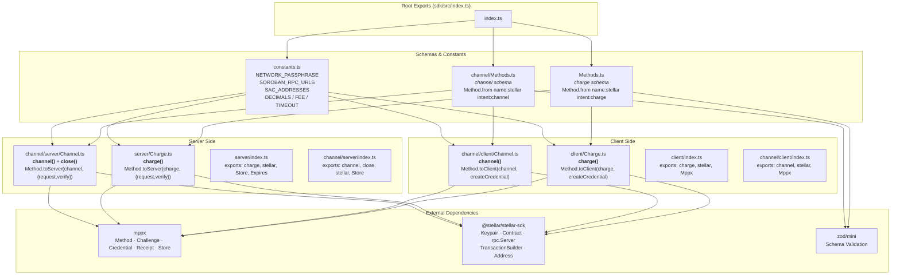

# Stellar MPP SDK — Module Architecture

```mermaid
graph TB
    subgraph "Root Exports (sdk/src/index.ts)"
        IDX["index.ts"]
    end

    subgraph "Schemas & Constants"
        METHODS["Methods.ts<br/><i>charge schema</i><br/>Method.from name:stellar intent:charge"]
        CH_METHODS["channel/Methods.ts<br/><i>channel schema</i><br/>Method.from name:stellar intent:channel"]
        CONST["constants.ts<br/>NETWORK_PASSPHRASE<br/>SOROBAN_RPC_URLS<br/>SAC_ADDRESSES<br/>DECIMALS / FEE / TIMEOUT"]
    end

    subgraph "Client Side"
        direction TB
        C_CHARGE["client/Charge.ts<br/><b>charge()</b><br/>Method.toClient(charge, createCredential)"]
        C_CHANNEL["channel/client/Channel.ts<br/><b>channel()</b><br/>Method.toClient(channel, createCredential)"]
        C_IDX["client/index.ts<br/>exports: charge, stellar, Mppx"]
        C_CH_IDX["channel/client/index.ts<br/>exports: channel, stellar, Mppx"]
    end

    subgraph "Server Side"
        direction TB
        S_CHARGE["server/Charge.ts<br/><b>charge()</b><br/>Method.toServer(charge, {request,verify})"]
        S_CHANNEL["channel/server/Channel.ts<br/><b>channel()</b> + <b>close()</b><br/>Method.toServer(channel, {request,verify})"]
        S_IDX["server/index.ts<br/>exports: charge, stellar, Store, Expires"]
        S_CH_IDX["channel/server/index.ts<br/>exports: channel, close, stellar, Store"]
    end

    subgraph "External Dependencies"
        MPPX["mppx<br/>Method · Challenge · Credential · Receipt · Store"]
        STELLAR["@stellar/stellar-sdk<br/>Keypair · Contract · rpc.Server<br/>TransactionBuilder · Address"]
        ZOD["zod/mini<br/>Schema Validation"]
    end

    IDX --> METHODS
    IDX --> CH_METHODS
    IDX --> CONST

    METHODS --> C_CHARGE
    METHODS --> S_CHARGE
    CH_METHODS --> C_CHANNEL
    CH_METHODS --> S_CHANNEL

    CONST --> C_CHARGE
    CONST --> S_CHARGE
    CONST --> C_CHANNEL
    CONST --> S_CHANNEL

    C_CHARGE --> MPPX
    C_CHARGE --> STELLAR
    C_CHANNEL --> MPPX
    C_CHANNEL --> STELLAR
    S_CHARGE --> MPPX
    S_CHARGE --> STELLAR
    S_CHANNEL --> MPPX
    S_CHANNEL --> STELLAR
    METHODS --> ZOD
    CH_METHODS --> ZOD
```
